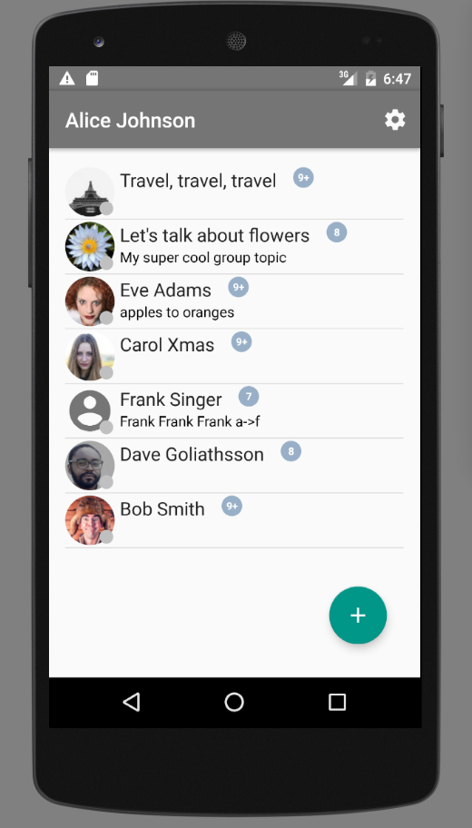
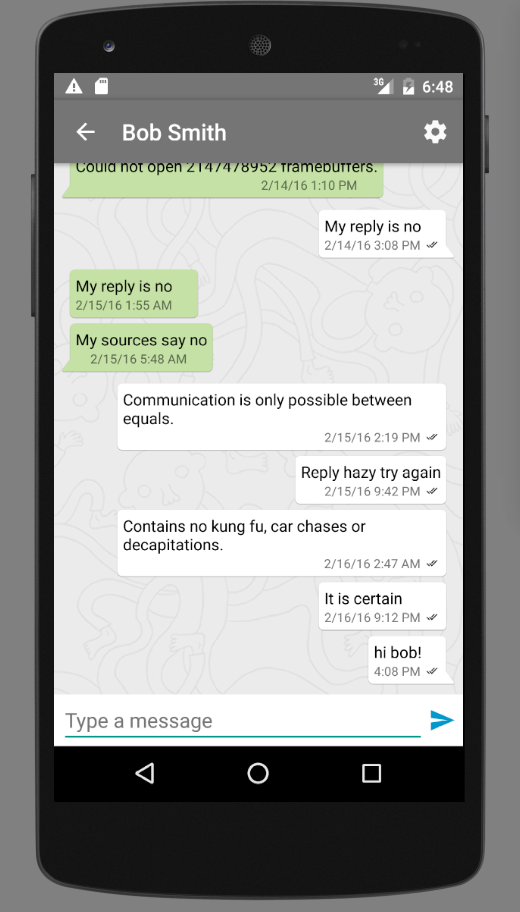

# Demo chat for Android

Work in progress. Somewhat functional: connects to the server, loads contacts and messages, sends messages.
Presence notifications work, message counters don't. A lot of buttons do nothing.

