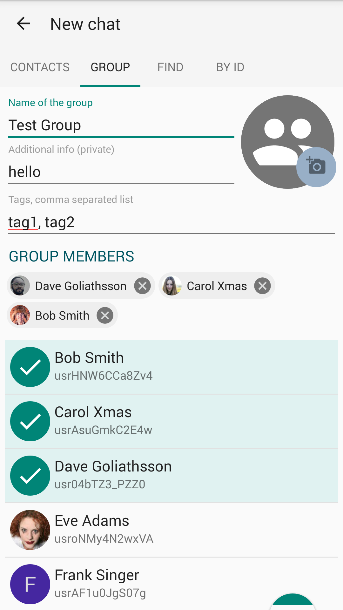

# Tindroid: Tinode Messaging Client for Android

Android instant messenger using [Tinode](https://github.com/tinode/chat/) backend. Beta-quality software.
Debug APKs are available in [releases](https://github.com/tinode/tindroid/releases).

<a href="https://play.google.com/store/apps/details?id=co.tinode.tindroidx"></a>

## Getting support

* Read [client-side](http://tinode.github.io/java-api/) and [server-side](https://github.com/tinode/chat/blob/master/docs/API.md) API documentation.
* For support, general questions, discussions post to [https://groups.google.com/d/forum/tinode](https://groups.google.com/d/forum/tinode).
* For bugs and feature requests [open an issue](https://github.com/tinode/tindroid/issues/new).

## What works:

* Send and receive messages one-on-one or in group chats.
* Register new accounts.
* Find contacts, start new chats.
* Edit chat parameters.
* In-app presence notifications.
* Unread message counters.
* Typing indicators.
* Push notifications.
* Delivered/received/read notifications (little check marks in messages).
* Markdown-style formatting of text, e.g. \*styled\* &rarr; **styled**. Implemented as spannable.
* Attachments and inline images.
* Muting/un-muting conversations and other permission management.
* Integration with Android's stock Contacts.
* Invite contacts to the app by SMS or email.
* Transport Level Security - https/wss.
* Offline mode is mostly functional.
* Editing of personal details.

## Not done yet:

* End-to-end encryption.
* No support for multiple servers.
* Mentions, hashtags.
* Replying or forwarding messages.
* Previews not generated for videos, audio, links or docs.

## Dependencies

### SDK (otherwise plain Java):

* [jackson](https://github.com/FasterXML/jackson) for json serialization.
* [Java-WebSocket](https://github.com/TooTallNate/Java-WebSocket/) for
websocket support.

### Application

* [libphonenumber](https://github.com/googlei18n/libphonenumber) for user discovery
to ensure all phone numbers use the same [E.164 format](https://en.wikipedia.org/wiki/E.164)
* [google-services](https://firebase.google.com/docs/cloud-messaging/android/client) for push notifications. See below.

## Other

Demo avatars and some other graphics are from https://www.pexels.com/ under [CC0 license](https://www.pexels.com/photo-license/).

Background patterns from http://subtlepatterns.com/, commercial and non-commercial use allowed with attribution.

The [`contacts.vcf`](./contacts.vcf) contains a list of contacts which can be used for testing. Push it to your emulator using command
```
adb push contacts.vcf /sdcard/contacts.vcf`
```

## Push notifications

If you want to use the app with your own server and want push notification to work you have to set them up:

* Register at https://firebase.google.com/, set up the project if you have not done so already.
* [Download your own](https://developers.google.com/android/guides/google-services-plugin) config file `google-services.json` and place it to the `app/` folder of your copy of Tindroid project. The config file contains keys specific to your Firebase/FCM registration.
* Copy Google-provided server key to `tinode.conf`, see details [here](https://github.com/tinode/chat/blob/master/docs/faq.md#q-how-to-setup-fcm-push-notifications).
* Recompile the app. If you add `google-services.json` incorrectly the app will compile but will later crash with non-obvious exceptions.

## Translations

Pull requests with translations are welcome. See [Russian translation](app/src/main/res/values-ru/strings.xml) as an example.


## Screenshots
  
  
