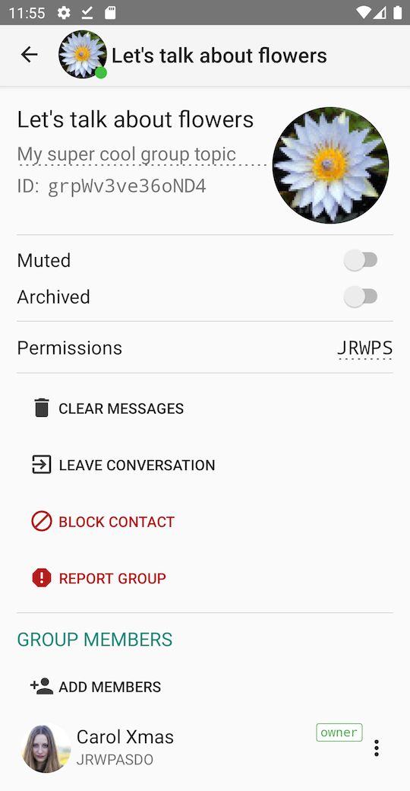
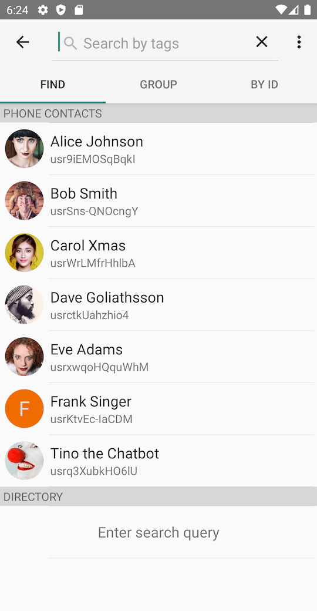
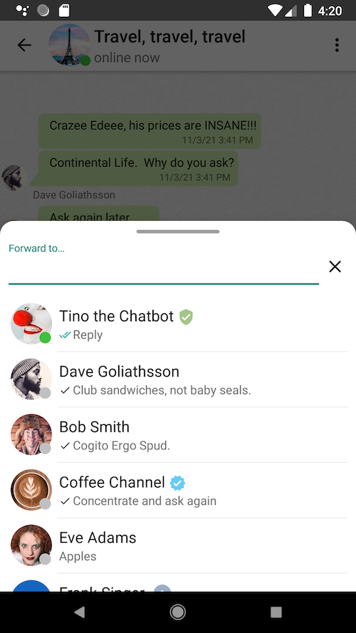

# Tindroid: Tinode Messaging Client for Android

Android instant messenger using [Tinode](https://github.com/tinode/chat/) backend. Beta-quality software.
Debug APKs are available in [releases](https://github.com/tinode/tindroid/releases).

<a href="https://play.google.com/store/apps/details?id=co.tinode.tindroidx"></a>

## Installing and running

This is NOT a standalone app, this is just a frontend, a client. It requires a [backend](https://github.com/tinode/chat/). See [installation instructions](https://github.com/tinode/chat/blob/master/INSTALL.md).

## Getting support

* Read [client-side](http://tinode.github.io/java-api/) and [server-side](https://github.com/tinode/chat/blob/master/docs/API.md) API documentation.
* For support, general questions, discussions post to [https://groups.google.com/d/forum/tinode](https://groups.google.com/d/forum/tinode).
* For bugs and feature requests [open an issue](https://github.com/tinode/tindroid/issues/new).
* Use https://tinode.co/contact for commercial inquiries.

## Helping out

* If you appreciate our work, please help spread the word! Sharing on Reddit, HN, and other communities helps more than you think.
* Consider buying paid support: https://tinode.co/support.html
* If you are a software developer, send us your pull requests with bug fixes and new features.
* If you use the app and discover bugs or missing features, let us know by filing bug reports and feature requests. Vote for existing feature requests you find most valuable.
* If you speak a language other than English, [translate](https://github.com/tinode/chat/blob/devel/docs/translations.md#android) the apps into your language. You may also review and improve existing translations.
* If you are a UI/UX expert, help us polish the app UI.
* Use it: install it for your colleagues or friends at work or at home. Please [contact us](https://tinode.co/contact) if you want to participate in [closed testing](https://support.google.com/googleplay/android-developer/answer/9845334?hl=en).

## What works:

* One-on-one conversations and group chats.
* Channels with unlimited number of read-only subscribers.
* Video and audio calling.
* Attachments, inline images and videos, voice messages.
* Unread message counters.
* Push notifications and in-app presence notifications.
* Message status notifications: message delivery to server; received and read notifications; typing notifications.
* Markdown-style formatting of text, e.g. \*styled\* &rarr; **styled**. Implemented as spannable.
* Editing sent messages, replying and forwarding messages.
* Trusted account badges: verified account, staff, etc.
* Form messages suitable for chatbots.
* File attachments, inline images and videos, voice messages.
* Muting/un-muting conversations and other granular permission management.
* Integration with Android's stock Contacts.
* Invite contacts to the app by SMS or email.
* Transport Level Security - https/wss.
* Offline mode.

## Not done yet:

* End-to-end encryption.
* Recording of video messages.
* No support for switching between multiple backends.
* No support for multiple accounts.
* Mentions, hashtags.
* Previews not generated for audio, links or docs.

## Direct Dependencies

### SDK:

* [Jackson](https://github.com/FasterXML/jackson) for JSON serialization.
* [Java-WebSocket](https://github.com/TooTallNate/Java-WebSocket/) for websocket support.

SDK contains no Android-specific dependencies.

### Application

* [Google-Services](https://firebase.google.com/docs/cloud-messaging/android/client) for push notifications. See below.
* [Crashlytics](https://firebase.google.com/docs/android/setup) for crash reporting.
* [Picasso](https://square.github.io/picasso/) for image downloading and caching.
* [Android Image Picker](https://github.com/esafirm/android-image-picker) for picking images or videos.
* [OSS Licenses Plugin](https://github.com/google/play-services-plugins/tree/master/oss-licenses-plugin) for legal compliance with OSS licenses.
* Standard Android dependencies.

## Other

Demo avatars and some other graphics are from https://www.pexels.com/ under [CC0 license](https://www.pexels.com/photo-license/).

Background patterns from http://subtlepatterns.com/, commercial and non-commercial use allowed with attribution.

The [`contacts.vcf`](./contacts.vcf) contains a list of contacts which can be used for testing. Push it to your emulator using command

```
adb push contacts.vcf /sdcard/contacts.vcf
```

## Push notifications

If you want to use the app with your own server and want push notification to work you have to set them up:

* Register at https://firebase.google.com/, set up the project if you have not done so already.
* [Download your own](https://developers.google.com/android/guides/google-services-plugin) config file `google-services.json` and place it to the `app/` folder of your copy of Tindroid project. The config file contains keys specific to your Firebase/FCM registration.
* Copy Google-provided server key to `tinode.conf`, see details [here](https://github.com/tinode/chat/blob/master/docs/faq.md#q-how-to-setup-fcm-push-notifications).
* Recompile the app. If you add `google-services.json` incorrectly the app will compile but will later crash with non-obvious exceptions.

## Translations

The app is currently available in the following languages:

* English
* Chinese (simplified)
* Chinese (traditional)
* French
* German
* Hindi
* Korean
* Portuguese
* Romanian
* Russian
* Spanish
* Ukrainian

More translations are welcome. See [instructions](https://github.com/tinode/chat/blob/devel/docs/translations.md#android).

## Screenshots

  
  
