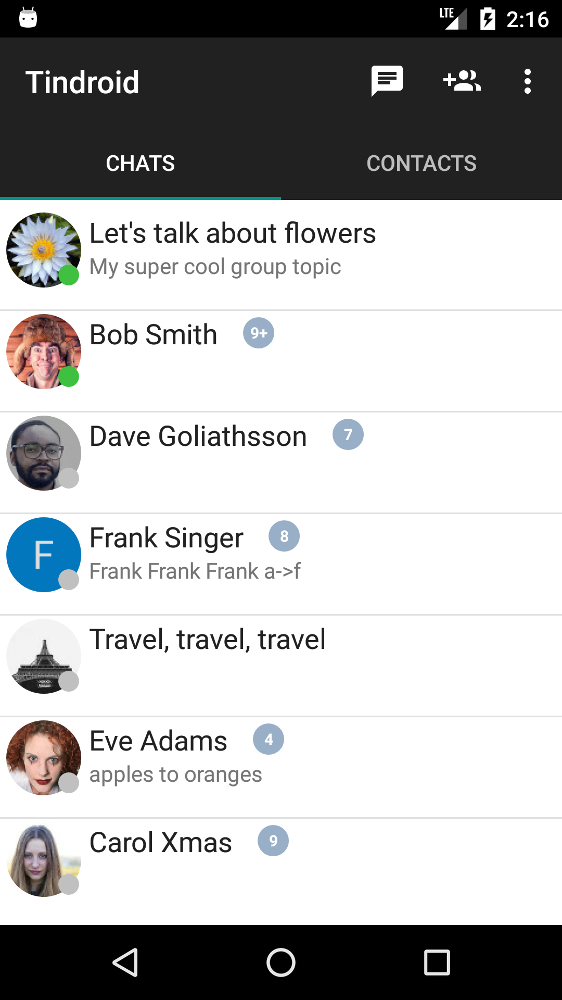
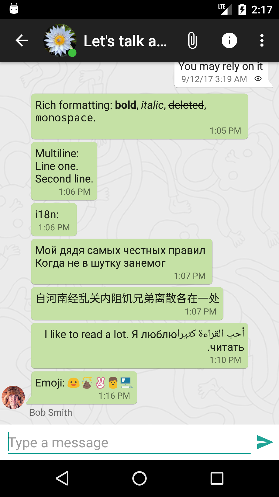
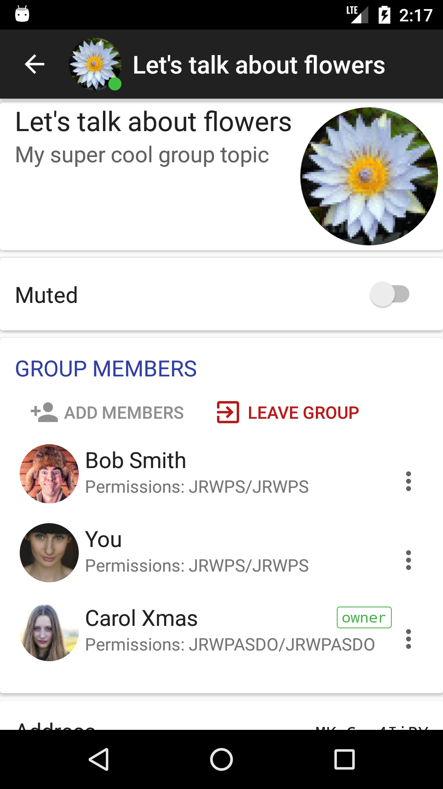
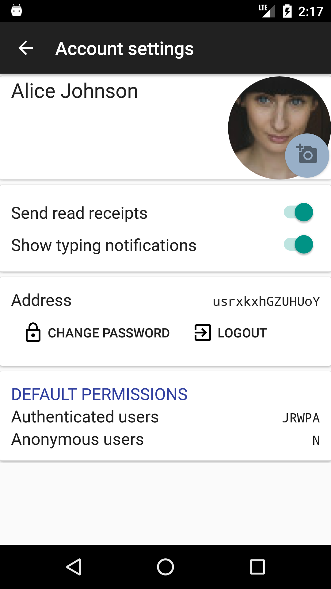

# Tindroid: Tinode Android client.

Android instant messenger using [Tinode](https://github.com/tinode/chat/) backend. Beta-quality software.
A [debug APK](https://storage.googleapis.com/tinode.co/tindroid.apk) is provided for convenience.

## Getting support

* Read [client-side](http://tinode.github.io/java-api/) and [server-side](https://github.com/tinode/chat/blob/master/docs/API.md) API documentation.
* For support, general questions, discussions post to [https://groups.google.com/d/forum/tinode](https://groups.google.com/d/forum/tinode).
* For bugs and feature requests [open an issue](https://github.com/tinode/tindroid/issues/new).

## What works:

* Send and receive messages one-on-one or in group chats.
* Register new accounts.
* Start new chats.
* Edit chat parameters.
* In-app presence notifications.
* Unread message counters.
* Typing indicators.
* Push notifications.
* Indicators for messages received/read (little check marks in messages).
* Markdown-style formatting of text, e.g. \*styled\* &rarr; **styled**. Implemented as spannable.
* Attachments and inline images.
* Muting/un-muting conversations and other permission management.
* Integration with Android's stock Contacts.
* Invite contacts to the app by SMS or email.
* Transport Level Security - https/wss.
* Offline mode is mostly functional.
* Editing of personal details.

## Does not work yet:

* No end-to-end encryption.

## Dependencies on the SDK side (otherwise plain Java):

* [jackson](https://github.com/FasterXML/jackson) for json serialization.
* [Java-WebSocket](https://github.com/TooTallNate/Java-WebSocket/) for
websocket support.

## Dependencies on the application side:

* [libphonenumber](https://github.com/googlei18n/libphonenumber) for user discovery
to ensure all phone numbers use the same [E.164 format](https://en.wikipedia.org/wiki/E.164)
* [MaterialChipsInput](https://github.com/pchmn/MaterialChipsInput) widget for group chat member selection.
This implementation is buggy and inflexible, should be replaced ASAP. Google should have provided this widget.
* [google-services](https://firebase.google.com/docs/cloud-messaging/android/client) for push notifications.
In order to compile the app you need to [download your own](https://developers.google.com/android/guides/google-services-plugin)
config file `google-services.json`. Once downloaded, copy it to the `./app/` folder. The
config file contains Google-provided passwords and as such cannot be shared. If you don't do it the
app will crash with non-obvious exceptions. The Google-provided server key must be copied to `tinode.conf`, see
details [here](https://github.com/tinode/chat).

The `contacts.vcf` contains a list of contacts which can be used for testing. Push it to your emulator using

  `adb push contacts.vcf /sdcard/contacts.vcf`

## Translations

Pull requests with translations are welcome. See [Russian translation](app/src/main/res/values-ru/strings.xml) as an example.

## Screenshots
  

