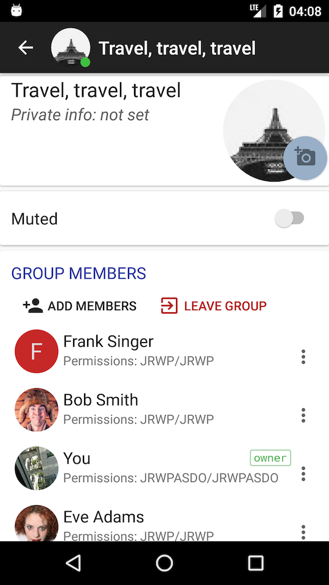
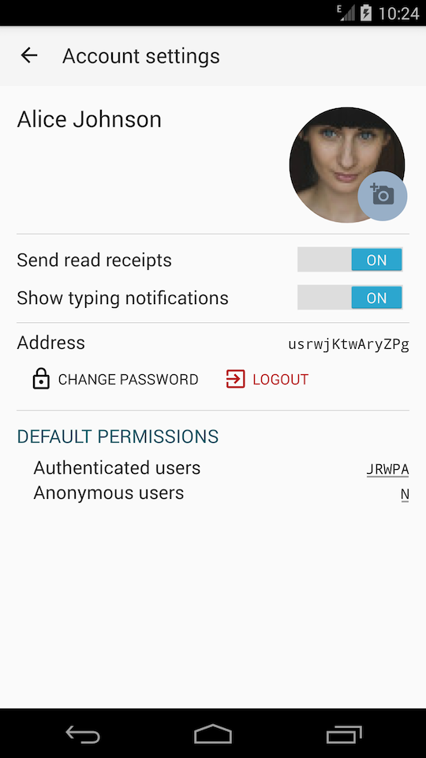

# Demo chat for Android

Beta-quality software. What works:

* Send and receive messages in p2p or group chats.
* Register new accounts.
* Start new group chats.
* Edit group chat parameters.
* In-app presence notifications.
* Unread message counters.
* Typing indicators.
* Push notifications.
* Indicators for messages received/read (little check marks in messages).
* Muting/unmuting conversations and other permission management.
* Load the list of contacts and store it offline.
* Access contacts from the Android stock Contacts app.
* Invite contacts to the app by SMS or email.
* Offline mode is mostly functional.
* Editing of personal details

Does not work yet:

* Contact discovery is done but not debugged yet
* Deleting messages
* No encryption

Dependencies on the SDK side (otherwise plain Java):

* [jackson](https://github.com/FasterXML/jackson) for json serialization
* [nv-websocket-client](https://github.com/TakahikoKawasaki/nv-websocket-client) for
websocket support

Dependencies on the application side:

* [libphonenumber](https://github.com/googlei18n/libphonenumber) for user discovery
to ensure all phone numbers use the same [E.164 format](https://en.wikipedia.org/wiki/E.164)
* [MaterialChipsInput](https://github.com/pchmn/MaterialChipsInput) widget for group chat member selection. 
This one is buggy and inflexible, should be replaced ASAP. Google should have provided this widget.
* [google-services](https://firebase.google.com/docs/cloud-messaging/android/client) for push notifications.
In order to compile the app you need to [generate your own](https://developers.google.com/mobile/add)
config file `google-services.json`. Once downloaded, copy it to the `./app/` folder. The
config file contains Google-provided passwords and as such cannot be shared. If you don't do it the 
app will crash with non-obvious exceptions. The Google-provided server key must be copied to `tinode.conf`, see 
details [here](https://github.com/tinode/chat). 

The `contacts.vcf` contains a list of contacts which can be used for testing. Push it to your emulator using

  `adb push contacts.vcf /sdcard/contacts.vcf`

## Screenshots
 
 